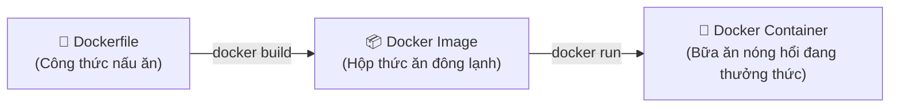

# 🐳 DOCKER TOÀN TẬP TỪ A ĐẾN Z DÀNH CHO NGƯỜI MỚI BẮT ĐẦU
> **Tác giả:** Người bạn trợ lý AI  
> **Dành riêng cho:** Anh em mới làm quen, người tự nhận "mù công nghệ" nhưng muốn hiểu thấu đáo bản chất, ứng dụng và làm chủ Docker mà không bị ngợp bởi thuật ngữ hàn lâm.  
> **Phiên bản:** Cập nhật nâng cao & Thực chiến chuyển giao Windows ➔ Linux

---

## 📌 MỤC LỤC
1. [Lời mở đầu: Nỗi oan "Sao trên máy tao chạy mà qua máy mày lại lỗi?"](#1-lời-mở-đầu-nỗi-oan-sao-trên-máy-tao-chạy-mà-qua-máy-mày-lại-lỗi)
2. [Bản chất Docker là gì qua các hình ảnh đời thực?](#2-bản-chất-docker-là-gì-qua-các-hình-ảnh-đời-thực)
3. [So sánh Docker vs Máy ảo (VMware / VirtualBox) — Tại sao Docker thắng lớn?](#3-so-sánh-docker-vs-máy-ảo-vmware--virtualbox--tại-sao-docker-thắng-lớn)
4. [Bộ Ba Nguyên Tử của thế giới Docker: Dockerfile, Image & Container](#4-bộ-ba-nguyên-tử-của-thế-giới-docker-dockerfile-image--container)
5. [Các khái niệm "vệ tinh" bắt buộc phải biết](#5-các-khái-niệm-vệ-tinh-bắt-buộc-phải-biết)
   - Docker Hub: Chợ ứng dụng khổng lồ
   - Port Mapping: Mở cửa đón khách
   - Volume: Chiếc USB chống "mất trí nhớ"
   - Docker Compose: Nhạc trưởng chỉ huy dàn nhạc
6. [Hướng dẫn cài đặt từ số 0 trên Windows (Kèm mẹo chuyển ổ đĩa)](#6-hướng-dẫn-cài-đặt-từ-số-0-trên-windows-kèm-mẹo-chuyển-ổ-đĩa)
7. [Từ điển câu lệnh "Bỏ túi" (Cheatsheet siêu dễ nhớ)](#7-từ-điển-câu-lệnh-bỏ-túi-cheatsheet-siêu-dễ-nhớ)
8. [Bài thực hành 30 giây: Bật một Website hoàn chỉnh chỉ với 1 câu lệnh](#8-bài-thực-hành-30-giây-bật-một-website-hoàn-chỉnh-chỉ-với-1-câu-lệnh)
9. [Đóng gói dự án thực tế (Source Code + Database) để đưa lên Server](#9-đóng-gói-dự-án-thực-tế-source-code--database-để-đưa-lên-server)
10. [Docker có tự "ngửi" công nghệ để sinh gói không? (docker init & AI)](#10-docker-có-tự-ngửi-công-nghệ-để-sinh-gói-không-docker-init--ai)
11. [Đóng gói thì nhẹ, bung ra có nặng không? Giải mã Dung lượng & RAM](#11-đóng-gói-thì-nhẹ-bung-ra-có-nặng-không-giải-mã-dung-lượng--ram)
12. [Dùng thuần Terminal (CLI) không cần Docker Desktop trên Linux & Windows](#12-dùng-thuần-terminal-cli-không-cần-docker-desktop-trên-linux--windows)
13. [Quy trình chuyển giao Windows ➔ Linux từ A đến Z (Kiểm tra & Bung gói)](#13-quy-trình-chuyển-giao-windows--linux-từ-a-đến-z-kiểm-tra--bung-gói)
14. [Hỏi Xoáy Đáp Xoay (FAQ): Top 10 thắc mắc & cạm bẫy người mới hay gặp](#14-hỏi-xoáy-đáp-xoay-faq-top-10-thắc-mắc--cạm-bẫy-người-mới-hay-gặp)
15. [Bí kíp tóm tắt 1 phút để nhớ suốt đời](#15-bí-kíp-tóm-tắt-1-phút-để-nhớ-suốt-đời)

---

## 1. LỜI MỞ ĐẦU: NỖI OAN "SAO TRÊN MÁY TAO CHẠY MÀ QUA MÁY MÀY LẠI LỖI?"

Hãy tưởng tượng một câu chuyện kinh điển trong giới công nghệ:
- Anh viết ra một phần mềm hoặc một website rất xịn trên máy tính của anh. Anh bấm chạy thử, mọi thứ mượt mà như nhung.
- Anh hào hứng đóng gói gửi cho sếp hoặc đồng nghiệp: *"Em gửi anh chạy thử nhé!"*.
- 5 phút sau, người kia gọi điện mắng vốn: *"Ủa sao anh mở lên nó báo lỗi đỏ lòm vậy? Không chạy được gì cả!"*.
- Anh vò đầu bứt tai kêu lên câu thần chú thế kỷ: **"Nhưng trên máy em nó vẫn chạy bình thường mà?!"**.

> [!NOTE]
> **Tại sao lại có hiện tượng quái gở này?**  
> Bởi vì một phần mềm muốn chạy được không chỉ cần mỗi đoạn mã (code), mà nó cần cả một "hệ sinh thái" đi kèm: phiên bản Windows/Linux, phiên bản Python/NodeJS, các thư viện phụ trợ, font chữ, cài đặt ngày giờ... Máy của anh đã vô tình cài sẵn những thứ đó từ trước, còn máy người khác thì **thiếu hoặc lệch phiên bản**.

👉 **Và thế là Docker ra đời với sứ mệnh lịch sử:**  
Thay vì chỉ gửi mỗi "phần mềm", Docker cho phép anh **đóng gói luôn cả phần mềm LẪN toàn bộ môi trường sống của nó** thành một chiếc hộp kín. Người nhận chỉ việc bê nguyên chiếc hộp đó về mở ra là chạy 100% giống hệt máy anh, không lệch dù chỉ 1 milimet!

---

## 2. BẢN CHẤT DOCKER LÀ GÌ QUA CÁC HÌNH ẢNH ĐỜI THỰC?

Nếu ai đó giải thích cho anh Docker là *"nền tảng ảo hóa mức hệ điều hành (OS-level virtualization) dựa trên Linux cgroups và namespaces"*, anh hãy bỏ ngoài tai ngay! Hãy hiểu nó qua 3 hình ảnh đời thường này:

### Ẩn dụ 1: Thùng Container trên tàu chở hàng (Nguồn gốc cái tên Docker)
Ngày xưa, người ta vận chuyển hàng hóa xuất khẩu rất cực: bao gạo thì mềm, thùng gốm thì dễ vỡ, con heo con bò thì chạy lung tung, xếp chung lên tàu biển rất dễ va đập hỏng hóc.  
Thế là người ta phát minh ra **Container chuẩn hóa**:
- Mọi thứ từ tivi, tủ lạnh đến cá đông lạnh đều được nhét gọn vào từng thùng container kim loại kích thước tiêu chuẩn.
- Tàu chở hàng (Docker) không cần quan tâm bên trong thùng chứa cái gì, chỉ cần cẩu thùng đặt lên boong tàu là chạy.
- Các thùng độc lập với nhau: Thùng đựng sầu riêng có bốc mùi cũng không làm ảnh hưởng đến thùng quần áo bên cạnh!

### Ẩn dụ 2: Hộp cơm Bento văn phòng
- Nếu anh mang đồ ăn đi làm mà để cơm một túi, canh một bọc ni-lông, đũa thìa một nơi: rất dễ quên thìa hoặc canh bị đổ.
- Hộp Bento chuẩn Nhật Bản: Có sẵn ngăn cơm, ngăn thức ăn, chỗ cài đũa, nắp đậy kín có gioăng cao su. Anh xách đi bất cứ đâu mở ra ăn cũng nguyên vẹn bữa cơm chuẩn chỉnh.

### Ẩn dụ 3: Căn hộ Studio IKEA Full Nội Thất
- Anh không cần phải tự đi mua từng viên gạch, tự lắp đường ống nước hay tự chọn ghế sofa.
- Căn hộ được đúc sẵn: giường, tủ, đèn ngủ, điều hòa đã đấu dây sẵn. Anh chỉ cần vặn chìa khóa bước vào ở.

---

## 3. SO SÁNH DOCKER VS MÁY ẢO (VMWARE / VIRTUALBOX) — TẠI SAO DOCKER THẮNG LỚN?

Trước khi Docker ra đời, người ta giải quyết bài toán môi trường bằng cách dùng **Máy ảo (Virtual Machine - VM)** như VMware Workstation hay VirtualBox. Nhưng máy ảo có điểm yếu chết người!

```
+------------------------------------+      +------------------------------------+
|            MÁY ẢO (VM)             |      |               DOCKER               |
+------------------------------------+      +------------------------------------+
|  [App 1]   |  [App 2]   |  [App 3] |      |  [App 1]   |  [App 2]   |  [App 3] |
| (Thư viện) | (Thư viện) | (Thư viện)|     | (Thư viện) | (Thư viện) | (Thư viện)|
+------------+------------+----------+      +------------+------------+----------+
| HĐH Khách  | HĐH Khách  | HĐH Khách|      |           DOCKER ENGINE            |
| (Guest OS) | (Guest OS) | (Guest OS)|     |       (Dùng chung nhân OS)         |
|  [Win 11]  |  [Ubuntu]  |  [CentOS]|      |                                    |
|   ~20GB    |   ~5GB     |   ~8GB   |      |                                    |
+------------+------------+----------+      +------------------------------------+
|        HYPERVISOR (Phần mềm VM)    |      |         HỆ ĐIỀU HÀNH GỐC           |
+------------------------------------+      |     (Host OS: Windows / Linux)     |
|         HỆ ĐIỀU HÀNH MÁY THẬT      |      +------------------------------------+
|         (Host OS: Windows)         |      |             PHẦN CỨNG              |
+------------------------------------+      |          (CPU, RAM, Ổ cứng)        |
|             PHẦN CỨNG              |      +------------------------------------+
+------------------------------------+
```

### Bảng so sánh "Một trời một vực":

| Tiêu chí | Máy ảo truyền thống (VMware/VirtualBox) | Docker Container |
| :--- | :--- | :--- |
| **Bản chất** | Giả lập **toàn bộ một chiếc máy tính ảo**, cài cả hệ điều hành độc lập (Guest OS). | **Chỉ đóng gói ứng dụng & thư viện**, dùng chung "trái tim" (Kernel) của máy thật. |
| **Dung lượng ổ cứng** | Nặng khủng khiếp (Mỗi máy ảo tốn **10 GB – 30 GB**). | Siêu nhẹ (Mỗi container chỉ từ **vài MB đến vài trăm MB**). |
| **Thời gian khởi động** | Chờ **1 đến 5 phút** như bật một máy tính mới. | Bật lên trong tích tắc (**1 đến 3 giây**). |
| **Tốn RAM & CPU** | Cực kỳ tốn (Ví dụ gán cứng 4GB RAM cho máy ảo là máy thật mất đứt 4GB). | Tiêu thụ vừa đúng mức ứng dụng cần, không lãng phí tài nguyên. |
| **Số lượng chạy cùng lúc** | Chạy 3-4 máy ảo là máy tính nóng rực, đơ cứng. | Chạy **vài chục container** cùng lúc máy vẫn lướt phơi phới. |

---

## 4. BỘ BA NGUYÊN TỬ CỦA THẾ GIỚI DOCKER: DOCKERFILE, IMAGE & CONTAINER

Đây là phần **quan trọng nhất**! Bất kỳ ai dùng Docker đều chỉ xoay quanh 3 khái niệm này. Anh chỉ cần nhớ công thức:

$$\text{Dockerfile} \xrightarrow{\text{Build (Nấu/Đúc)}} \text{Docker Image} \xrightarrow{\text{Run (Khởi chạy)}} \text{Docker Container}$$



### 1. Dockerfile — Tờ giấy công thức nấu ăn
- Là một file văn bản trần trụi (không có đuôi file), bên trong anh ghi lại các bước hướng dẫn từng bước:
  - *"Bước 1: Lấy hệ điều hành Ubuntu/Alpine siêu nhẹ làm nền"*.
  - *"Bước 2: Cài Python phiên bản 3.11"*.
  - *"Bước 3: Chép thư mục code của tôi vào"*.
  - *"Bước 4: Chạy lệnh `python main.py`"*.

### 2. Docker Image (Hình ảnh) — Chiếc bánh đã đóng hộp đông lạnh
- Khi anh chạy lệnh `docker build`, Docker sẽ đọc tờ công thức `Dockerfile` ở trên và "đúc" ra một file gọi là **Image**.
- Image là một khối bất biến (chỉ đọc - Read-only), chứa đầy đủ mọi thứ cần thiết.
- Anh có thể mang file Image này gửi cho bất kỳ ai trên thế giới.

### 3. Docker Container (Vật chứa) — Chiếc bánh rã đông đang ăn trên đĩa
- Khi anh lấy Image ra và bấm lệnh `docker run`, Docker sẽ "kích hoạt" nó lên thành một tiến trình đang sống, gọi là **Container**.
- Container chính là một ứng dụng đang thực sự chạy, đang tiêu tốn CPU, RAM và có thể tương tác được.
- Từ **1 Image duy nhất**, anh có thể nhân bản và chạy cùng lúc **10 Container giống nhau** (Ví dụ chạy cùng lúc 10 con web server).
- Khi anh tắt hoặc xóa Container đi, cái Image gốc vẫn còn y nguyên, không hề bị sứt mẻ!

---

## 5. CÁC KHÁI NIỆM "VỆ TINH" BẮT BUỘC PHẢI BIẾT

### 5.1. Docker Hub — "Chợ ứng dụng / Siêu thị đông lạnh"
- Nếu ai cũng phải tự viết `Dockerfile` từ đầu để cài MySQL, PostgreSQL, WordPress hay Nginx thì quá mệt!
- **Docker Hub** ([hub.docker.com](https://hub.docker.com)) là trang web chính thức nơi cộng đồng và các công ty công nghệ lớn (Microsoft, Google, Oracle...) đẩy sẵn hàng triệu Image chuẩn lên đó.
- Anh muốn dùng cơ sở dữ liệu Postgres? Không cần tải bộ cài `.exe` rồi bấm Next-Next-Finish. Anh chỉ cần gõ 1 dòng:
  ```powershell
  docker run -d -p 5432:5432 --name my-postgres -e POSTGRES_PASSWORD=secret postgres
  ```
  👉 Docker tự lên Docker Hub tải về và bật một máy chủ Postgres chuẩn xịn trong đúng 15 giây!

---

### 5.2. Port Mapping (Ánh xạ cổng mạng) — Mở cửa đón khách
Container là một chiếc hộp kín cách ly hoàn toàn với máy tính của anh. Nếu ứng dụng trong hộp mở cổng mạng `80` (cổng web), người ngồi ngoài máy tính sẽ **không thể truy cập được** trừ khi anh tạo một "ống dẫn".

Tham số `-p [Cổng Máy Thật]:[Cổng Container]`
- Ví dụ: `-p 8080:80`
- Nghĩa là: Khi ai đó gõ vào trình duyệt `http://localhost:8080` ở máy thật, máy tính sẽ tự động luồn dây chuyển tiếp tín hiệu vào cổng `80` bên trong Container.

---

### 5.3. Docker Volume — Chiếc USB chống "mất trí nhớ"

> [!CAUTION]
> **CẢNH BÁO QUAN TRỌNG:** Bản chất của Container là "vô thường" (ephemeral). Nếu anh chạy cơ sở dữ liệu bên trong container, người dùng thêm 1.000 đơn hàng vào đó. Nhưng một ngày đẹp trời anh gõ lệnh xóa Container (`docker rm`), thì **toàn bộ 1.000 đơn hàng sẽ bay màu biến mất vĩnh viễn theo container!**

Để giải quyết vấn đề này, Docker sinh ra **Volume**:
- Hãy tưởng tượng Volume giống như chiếc **ổ cứng gắn ngoài (USB)** cắm từ máy tính thật xuyên vào bên trong Container.
- Ứng dụng cứ ghi dữ liệu thoải mái. Toàn bộ dữ liệu thực chất được lưu trên ổ cứng máy thật.
- Mai này container có bị cháy, bị xóa hay nâng cấp phiên bản mới, anh chỉ cần tạo container mới và cắm lại chiếc "USB" này vào, toàn bộ dữ liệu 1.000 đơn hàng vẫn nguyên vẹn 100%!

---

### 5.4. Docker Compose — Vị "Nhạc trưởng" chỉ huy cả dàn nhạc
Giả sử dự án của anh gồm 2-3 thành phần (Code Backend + Cơ sở dữ liệu Postgres).  
Nếu dùng Docker đơn lẻ, anh phải gõ nhiều câu lệnh dài dòng.  
👉 **Docker Compose xuất hiện:**  
- Gom tất cả vào 1 file `docker-compose.yml`.
- Khởi động toàn bộ dự án chỉ bằng 1 lệnh: `docker compose up -d`.
- Tắt toàn bộ hệ thống: `docker compose down`.

---

## 6. HƯỚNG DẪN CÀI ĐẶT TỪ SỐ 0 TRÊN WINDOWS (KÈM MẸO CHUYỂN Ổ ĐĨA)

### Bước 1: Kích hoạt WSL 2 (Windows Subsystem for Linux)
Mở cửa sổ **PowerShell với quyền Administrator** và chạy:
```powershell
wsl --install
```
*(Khởi động lại máy nếu Windows yêu cầu)*

### Bước 2: Cài Docker Desktop
1. Tải bộ cài chính thức tại: [https://www.docker.com/products/docker-desktop/](https://www.docker.com/products/docker-desktop/)
2. Bật file cài đặt lên, giữ nguyên dấu tích chọn: **"Use WSL 2 instead of Hyper-V (recommended)"**.
3. Bấm Install và chờ 3-5 phút hoàn tất.

### Bước 3: Mẹo sống còn tránh tràn ổ C!
Vào Docker Desktop ➔ **Settings (Bánh răng)** ➔ **Resources** ➔ **Advanced** ➔ Tìm mục **Disk image location** và đổi sang ổ `D:\Docker\wsl`.

---

## 7. TỪ ĐIỂN CÂU LỆNH "BỎ TÚI" (CHEATSHEET SIÊU DỄ NHỚ)

```powershell
# Xem container đang chạy
docker ps

# Xem tất cả container (kể cả đã tắt)
docker ps -a

# Xem danh sách image có trong máy
docker images

# Chạy container mới
docker run -d -p 8080:80 --name my-web nginx

# Dừng container
docker stop my-web

# Khởi động lại container đã dừng
docker start my-web

# Xóa container
docker rm my-web

# Dọn dẹp rác, giải phóng ổ cứng sạch bong
docker system prune -a --volumes
```

---

## 8. BÀI THỰC HÀNH 30 GIÂY: BẬT MỘT WEBSITE HOÀN CHỈNH CHỈ VỚI 1 CÂU LỆNH

Mở terminal lên và gõ:
```powershell
docker run -d -p 8080:80 --name test-docker nginxdemos/hello
```
Mở trình duyệt gõ: `http://localhost:8080` là website đã chạy!  
Xóa đi khi test xong: `docker rm -f test-docker`.

---

## 9. ĐÓNG GÓI DỰ ÁN THỰC TẾ (SOURCE CODE + DATABASE) ĐỂ ĐƯA LÊN SERVER

Đây là câu hỏi cốt lõi của anh: **"Máy anh đang có Source Code, có DB, muốn đóng gói đưa lên server rồi bung ra thì có ổn không? Thực hiện thế nào?"**

> [!IMPORTANT]
> **CÂU TRẢ LỜI LÀ: CỰC KỲ ỔN VÀ ĐÂY LÀ TIÊU CHUẨN VÀNG CỦA CẢ THẾ GIỚI!**  
> Nhưng anh cần nắm vững **NGUYÊN TẮC BẤT DI BẤT DỊCH VỀ DATABASE**:
> - **Source code:** Đóng gói thành Docker Image của riêng anh.
> - **Database (Postgres, MySQL, SQL Server):** **KHÔNG** tự đóng gói phần mềm DB, mà lấy trực tiếp Image chuẩn từ Docker Hub (được các hãng tối ưu bảo mật cực cao).
> - **Dữ liệu thật của DB:** **KHÔNG** đúc chết vào Image (vì Image là bất biến, làm thế Image sẽ nặng hàng chục GB và lộ mật khẩu). Dữ liệu thật sẽ được kết nối qua **Docker Volume** và file sao lưu `.sql`!

### Quy trình 3 bước thực chiến đóng gói Source + DB:

#### Bước 1: Tạo `Dockerfile` cho thư mục Source Code của anh
*(Ví dụ dự án Python Backend/Dashboard)*
```dockerfile
# Sử dụng Python nhẹ nhàng
FROM python:3.11-slim

# Thư mục làm việc trong container
WORKDIR /app

# Chép file thư viện và cài đặt
COPY requirements.txt .
RUN pip install --no-cache-dir -r requirements.txt

# Chép toàn bộ code vào
COPY . .

# Mở cổng chạy ứng dụng
EXPOSE 8000

# Lệnh khởi động app
CMD ["python", "manage.py", "runserver", "0.0.0.0:8000"]
```

#### Bước 2: Dùng `docker-compose.yml` để "kết duyên" Code và Database
Tạo file `docker-compose.yml` nằm ngay cạnh source code:
```yaml
version: '3.8'

services:
  # Dịch vụ 1: Database Postgres (Kéo sẵn từ chợ Docker Hub về)
  db:
    image: postgres:15-alpine
    container_name: my_db
    restart: always
    environment:
      POSTGRES_DB: my_project_db
      POSTGRES_USER: admin
      POSTGRES_PASSWORD: mysecretpassword
    volumes:
      - db_data:/var/lib/postgresql/data  # Cắm USB lưu dữ liệu vĩnh viễn
      - ./init.sql:/docker-entrypoint-initdb.d/init.sql # Tự động nạp dữ liệu ban đầu
    ports:
      - "5432:5432"

  # Dịch vụ 2: Web App của anh
  web:
    build: .
    container_name: my_app
    restart: always
    ports:
      - "8000:8000"
    environment:
      - DB_HOST=db
      - DB_NAME=my_project_db
      - DB_USER=admin
      - DB_PASS=mysecretpassword
    depends_on:
      - db

volumes:
  db_data: # Khai báo ổ cứng lưu dữ liệu
```

#### Bước 3: Xuất dữ liệu Database hiện có ra file `init.sql`
Anh chỉ cần xuất (Dump/Export) dữ liệu đang có trên máy thành 1 file `init.sql`, đặt chung thư mục. Khi bung ra trên server, Docker sẽ tự động nạp toàn bộ bảng biểu và dữ liệu vào Database mới tinh mà anh không cần làm thêm bất kỳ thao tác thủ công nào!

---

## 10. DOCKER CÓ TỰ "NGỬI" CÔNG NGHỆ ĐỂ SINH GÓI KHÔNG? (DOCKER INIT & AI)

Anh thắc mắc: *"Docker có tự detect được các công nghệ có sẵn trong source để đóng gói không?"*

### 1. Bản thân Docker Engine thuần:
Không tự động "ngửi". Nó cần anh đưa cho nó tờ công thức (`Dockerfile`).

### 2. Nhưng Docker CLI hiện đại đã có vũ khí bí mật: `docker init`!
Từ phiên bản Docker Desktop 4.19 trở đi, Docker đã tích hợp sẵn lệnh trí tuệ nhân tạo nhận diện dự án:
```powershell
# Đứng tại thư mục chứa source code của anh và gõ:
docker init
```
**Chuyện gì sẽ xảy ra?**
- Docker sẽ tự động quét thư mục dự án của anh:
  - *"A, thấy file `package.json`! Dự án này là **Node.js**!"*
  - Hoặc *"A, thấy file `requirements.txt` / `manage.py`! Dự án này là **Python**!"*
  - Hoặc *"A, thấy file `pom.xml` / `go.mod`! Dự án là **Java / Go**!"*
- Docker sẽ hỏi anh vài câu hỏi đơn giản (Cổng mấy? Phiên bản mấy?).
- Sau đó nó **TỰ ĐỘNG TẠO RA 100%**:
  1. `Dockerfile` chuẩn tối ưu
  2. `docker-compose.yml`
  3. `.dockerignore` (để không chép rác vào gói)
  4. File `README.Docker.md` hướng dẫn chạy!

### 3. Nhờ AI (Gemini / Antigravity / ChatGPT):
Nếu dự án có cấu trúc phức tạp, anh chỉ cần quăng danh sách file cho em (AI trợ lý), em sẽ viết sẵn `Dockerfile` và `docker-compose.yml` tối ưu tận răng cho anh chỉ trong 5 giây!

---

## 11. ĐÓNG GÓI THÌ NHẸ, BUNG RA CÓ NẶNG KHÔNG? GIẢI MÃ DUNG LƯỢNG & RAM

Anh nhận xét rất tinh tế: *"Theo anh thấy thì đóng gói lại rất nhẹ, nhưng bung gói đã đóng thì có nặng không?"*

Đây là bí mật kiến trúc của Docker:

### 1. Dung lượng khi đóng gói (File Nén - Compressed):
- Khi nén lại thành file `.tar` hoặc đẩy lên mạng (Docker Registry), Docker chỉ lưu các lớp dữ liệu đã nén.
- Dung lượng thường chỉ từ **50 MB đến 200 MB** (rất nhẹ để gửi qua mạng hoặc copy USB).

### 2. Dung lượng khi bung ra trên ổ cứng (Uncompressed on Disk):
- Khi bung ra, Docker giải nén các thư viện, file nhị phân của Linux/Python/Nodejs.
- Dung lượng trên đĩa sẽ nở ra khoảng **200 MB đến 800 MB**. So với một máy ảo VMware (20 GB đến 40 GB) thì nó **vẫn nhỏ hơn từ 30 đến 50 lần**!

### 3. Cơ chế "Dùng Chung Lớp" (Layer Sharing) — Càng chạy nhiều càng tiết kiệm:
Giả sử anh chạy 5 dự án Python khác nhau trên cùng một máy:
- **Nếu dùng máy ảo:** 5 máy ảo x 10GB = **50 GB** ổ cứng!
- **Với Docker:** Cả 5 ứng dụng đều dùng chung lớp nền `python:3.11-slim` (khoảng 150MB). Docker **chỉ tải lớp nền này 1 lần duy nhất**! 5 container chỉ tốn thêm vài chục MB code riêng biệt. Ổ cứng chỉ tốn ~300MB thay vì 50GB!

### 4. Tiêu thụ bộ nhớ RAM khi chạy thực tế (Runtime Memory):
- Docker **KHÔNG ngốn RAM cố định**.
- Một container NodeJS chỉ ăn khoảng **50MB - 80MB RAM**.
- Một container Python chỉ ăn khoảng **40MB - 70MB RAM**.
- Cơ sở dữ liệu Postgres lúc nghỉ chỉ ăn khoảng **30MB - 50MB RAM**.
👉 Tổng cộng cả hệ thống của anh chạy mượt mà mà ngốn chưa tới **300MB RAM**!

---

## 12. DÙNG THUẦN TERMINAL (CLI) KHÔNG CẦN DOCKER DESKTOP TRÊN LINUX & WINDOWS

Anh hỏi: *"Anh có 2 máy 1 Windows, 1 Linux thì anh không cài Docker Desktop mà kiểu muốn thuần terminal thì được chứ?"*

> [!TIP]
> **ĐƯỢC 100%! VÀ ĐÓ CHÍNH LÀ ĐẲNG CẤP CỦA DÂN PRO VÀ MÔI TRƯỜNG SERVER!**

### 1. Trên máy Linux (Server hoặc máy tính cá nhân Linux):
- **Tuyệt đối KHÔNG cài Docker Desktop!** Trên Linux, 99.9% người ta dùng **Docker Engine thuần CLI**.
- Nó không có giao diện đồ họa nặng nề, khởi động cùng hệ thống, cực kỳ ổn định, tiết kiệm từng giọt RAM và CPU.
- Quản lý 100% bằng bàn phím gõ lệnh qua SSH hoặc Terminal.

### 2. Trên máy Windows:
Có 2 cách để dùng "thuần terminal" trên Windows:
- **Cách 1 (Chuẩn bài nhất): Cài Docker Desktop nhưng không thèm mở giao diện:**
  - Vẫn cài Docker Desktop để nó lo phần nền tảng ảo hóa WSL 2 cho Windows.
  - Nhưng anh không cần mở màn hình app lên, cứ mở **PowerShell** hoặc **Windows Terminal** gõ lệnh `docker ...` là xong.
- **Cách 2 (Thuần 100% không cài Docker Desktop):**
  - Cài WSL 2 Ubuntu trên Windows.
  - Chui vào bên trong Ubuntu (`wsl`) và cài Docker Engine trực tiếp bằng lệnh Linux giống hệt máy Linux thật!

---

## 13. QUY TRÌNH CHUYỂN GIAO WINDOWS ➔ LINUX TỪ A ĐẾN Z (KIỂM TRA & BUNG GÓI)

Đây là kịch bản thực tế khi anh muốn chuyển dự án từ máy Windows sang máy Linux:

```
[ Máy 1: Windows ]                                  [ Máy 2: Linux ]
  │                                                   │
  ├── 1. Viết Dockerfile & docker-compose.yml         ├── 4. Kiểm tra có Docker chưa?
  ├── 2. Đóng gói Image                               │     (docker --version)
  └── 3. Chuyển gói sang Linux ──────────────────────►├── 5. Nạp gói vào máy Linux
        (Cách A: Docker Hub)                          │     (docker load hoặc pull)
        (Cách B: Xuất file .tar qua mạng LAN)         └── 6. Bật hệ thống lên!
                                                            (docker compose up -d)
```

### Bước 1: Kiểm tra xem máy Linux đã cài Docker chưa?
Trên máy Linux, mở Terminal lên và gõ:
```bash
# Kiểm tra phiên bản docker
docker --version

# Kiểm tra dịch vụ docker có đang chạy không
sudo systemctl status docker

# Kiểm tra docker compose
docker compose version
```

> [!IMPORTANT]
> **NẾU MÁY LINUX CHƯA CÓ DOCKER?**  
> Anh chỉ cần copy dán đúng **1 dòng lệnh thần thánh chính thức của Docker** (áp dụng cho Ubuntu, Debian, CentOS...):
> ```bash
> curl -fsSL https://get.docker.com -o get-docker.sh && sudo sh get-docker.sh
> ```
> *(Lệnh này sẽ tự động tải và cài đặt Docker chuẩn chỉ từ A đến Z trong vòng 1 phút!)*  
> Sau đó cấp quyền chạy không cần gõ `sudo`:
> ```bash
> sudo usermod -aG docker $USER
> newgrp docker
> ```

---

### Bước 2: Hai cách đóng gói trên Windows và bung ra trên Linux

#### CÁCH 1: Chuyển qua mạng nội bộ / Offline bằng File `.tar` (Không cần tài khoản, cực nhanh)

**Tại máy Windows:**
```powershell
# 1. Đứng tại thư mục code, build thành image
docker build -t my-project:1.0 .

# 2. Xuất chiếc bánh Image thành 1 file nén duy nhất
docker save -o my-project.tar my-project:1.0
```
👉 Lúc này anh có file `my-project.tar`. Anh copy file này cùng file `docker-compose.yml` và file `init.sql` sang máy Linux (bằng USB, qua mạng LAN chia sẻ, hoặc dùng phần mềm WinSCP / lệnh `scp`).

**Tại máy Linux (Bung gói ra):**
```bash
# 1. Đi tới thư mục chứa các file vừa copy qua
cd /home/user/my-project

# 2. Nạp chiếc bánh Image vào Docker của Linux
docker load -i my-project.tar

# 3. Kéo cờ khởi động toàn bộ ứng dụng và Database!
docker compose up -d
```
🎉 **BÙM!** Toàn bộ ứng dụng và cơ sở dữ liệu bung ra chạy vù vù trên Linux trong đúng 3 giây!

---

#### CÁCH 2: Chuyển qua Docker Hub (Chuẩn quốc tế - Online)

**Tại máy Windows:**
```powershell
# 1. Đăng nhập Docker Hub
docker login

# 2. Build và gắn tên tài khoản
docker build -t ten_tai_khoan/my-project:1.0 .

# 3. Bắn Image lên mây Docker Hub
docker push ten_tai_khoan/my-project:1.0
```

**Tại máy Linux:**
Chỉ cần copy mỗi file `docker-compose.yml` sang máy Linux (trong file chỉnh `image: ten_tai_khoan/my-project:1.0`), sau đó gõ:
```bash
docker compose up -d
```
👉 Máy Linux sẽ tự động lên Docker Hub kéo Image về và tự kích hoạt mọi thứ!

---

## 14. HỎI XOÁY ĐÁP XOAY (FAQ): TOP 10 THẮC MẮC & CẠM BẪY NGƯỜI MỚI HAY GẶP

### Q1: Tắt máy tính hoặc tắt Docker Desktop thì Container có còn chạy không?
> **Đáp:** Không ạ. Khi anh tắt máy tính hoặc tắt phần mềm Docker Desktop, toàn bộ Container sẽ dừng lại. Khi bật máy lên, nếu anh cài `--restart always`, container sẽ tự thức dậy chạy cùng máy.

### Q2: Docker khác gì Git và GitHub?
> **Đáp:** 
> - **Git / GitHub:** Quản lý **mã nguồn văn bản** (những dòng code anh viết).
> - **Docker / Docker Hub:** Quản lý **toàn bộ cỗ máy đã ráp hoàn thiện** (code + môi trường + thư viện) sẵn sàng nổ máy chạy.

### Q3: Đóng gói trên Windows có mang sang Linux chạy được không? Có bị xung đột hệ điều hành không?
> **Đáp:** **Hoàn toàn KHÔNG xung đột!** Vì khi anh build Docker Image trên Windows (dùng WSL 2), Image đó thực chất đã được đóng gói theo định dạng chuẩn của Linux. Do đó khi mang sang máy Linux thật, nó chạy như cá gặp nước, tương thích 100%!

### Q4: Máy tính cấu hình yếu (8GB RAM) có chạy Docker nổi không?
> **Đáp:** Chạy rất tốt! Một container Python/NodeJS + Postgres chỉ ăn khoảng 200MB - 300MB RAM.

### Q5: Nếu Database của anh đang có sẵn hàng triệu dòng dữ liệu trên máy Windows thì làm sao mang sang?
> **Đáp:** Anh chỉ cần dùng công cụ quản lý DB (như DBeaver, Navicat, pg_dump, mysqldump) xuất ra file `.sql`. Khi sang máy Linux, chỉ cần cắm file `.sql` đó vào thư mục khởi tạo của container DB, Docker sẽ tự động nạp toàn bộ vào hệ thống mới!

---

## 15. BÍ KÍP TÓM TẮT 1 PHÚT ĐỂ NHỚ SUỐT ĐỜI

1. **Đóng gói dự án có DB:** Code đóng gói thành Image, DB kéo từ Docker Hub về, nối nhau bằng `docker-compose.yml`.
2. **Tự động nhận diện công nghệ:** Dùng lệnh `docker init` trong thư mục code.
3. **Bung gói có nặng không:** Rất nhẹ! Image chỉ vài trăm MB, ăn vài trăm MB RAM, các container dùng chung lớp nền tiết kiệm ổ cứng tối đa.
4. **Dùng dòng lệnh trên Linux:** Chuẩn 100%, dùng `docker-ce` thuần không cần giao diện Desktop.
5. **Chuyển giao Windows sang Linux:** 
   - Windows: `docker save -o my-app.tar my-app`
   - Linux: `docker load -i my-app.tar` rồi `docker compose up -d` là xong!

---
*(Tài liệu được lưu trữ tại `public_documents/Docker_Toan_Tap_Cho_Nguoi_Moi.md` phục vụ việc tra cứu và thực hành trọn đời)*
